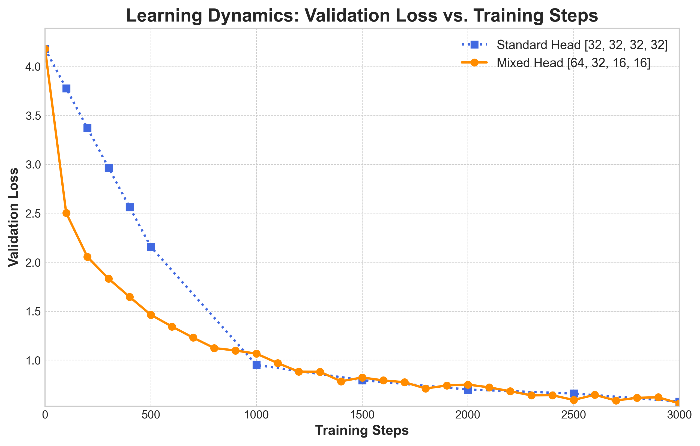
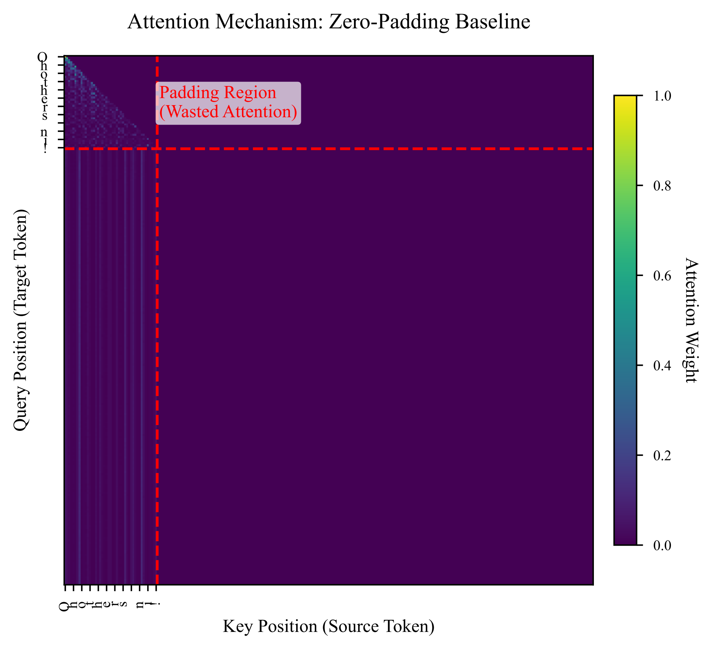
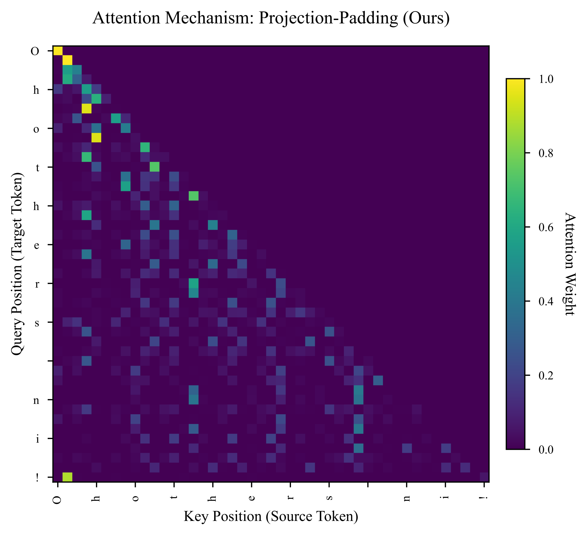

# STP-DFT: 基于投影填充的无维度 Transformer (Dimension-Free Transformer)


本项目是论文 **STP-DFT** (Dimension-Free Transformer with Projection Padding) 的官方 PyTorch 实现代码。

我们针对变长序列（Heterogeneous Batches）计算效率低下的问题，提出了一种基于 **投影填充 (Projection Padding)** 的新型注意力机制。该方法通过引入半张量积（Semi-Tensor Product, STP）理论，实现了真正的“无维度”计算，从根本上解决了传统 Transformer 在处理不定长输入时依赖 **零填充 (Zero-Padding)** 导致的显存浪费与计算冗余问题。

## 🔬 核心创新 (Key Contributions)

### 1. 投影填充 (Projection Padding)
传统的 Transformer 强制要求同一 Batch 内的所有序列补齐到最大长度 $L_{max}$，导致大量的无效计算（Attention map 中存在大量 Masked 区域）。
**STP-DFT** 引入了投影层 `project(x, n0)`，将任意长度为 $n_i$ 的序列动态投影到统一的名义维度 $n_0$ (Nominal Dimension) 进行计算，处理完后再投影回原始长度。
这不仅消除了无效的 Padding，还实现了参数共享与维度解耦。

### 2. 无维度线性层 (Dimension-Free Linear Layer)
我们在 `dft_model.py` 中实现了 `DimensionFreeLinear` (Definition 4.13 in paper)。
该层允许输入序列的维度动态变化，通过三步过程完成线性变换：
1.  **Project-Padding**: $R^{n_i} \to R^{n_0}$
2.  **Standard Transformation**: $W \cdot x$
3.  **Project-Unpadding**: $R^{n_0} \to R^{n_i}$

### 3. 非对称注意力机制 (Asymmetric Attention)
支持 Q, K, V 拥有不同的维度投影，并通过 **跨维度内积 (Cross-Dim Inner Product)** 计算注意力分数，打破了标准 Transformer 中必须 $d_k = d_q$ 的限制。

## 📊 实验结果 (Results)

我们在 Shakespeare 和 OpenWebText 数据集上验证了 STP-DFT 的有效性。

### 参数效率与 Loss 收敛
实验表明，在相同参数量下，STP-DFT 相比标准 Zero-Padding Transformer 具有更快的收敛速度和更低的最终 Loss。



### 注意力热力图对比
可视化结果清晰地展示了 STP-DFT 如何避免对“填充区域”的无效关注：

| Zero-Padding (Baseline) | Projection-Padding (Ours) |
|:-----------------------:|:-------------------------:|
|  |  |
| *存在大量红色虚线框内的无效注意力* | *注意力集中在有效语义区域* |

*(更多详细对比请见 `assets/` 目录下的 PDF 文件)*

## 📂 目录结构

本项目已针对开源进行了重新整理：

*   `src/`: 核心代码库
    *   `dft_model.py`: **核心实现** (包含 `DimensionFreeLinear`, `CausalSelfAttentionDFT`)
    *   `train.py`: 训练脚本
*   `experiments/`: 实验性代码 (包含不同维度的消融实验 `dim_vary/`)
*   `scripts/`: 论文绘图与分析脚本 (如 `visualize_attention.py`, 对应论文 Figure 3)
*   `notebooks/`: 探索性数据分析 (Scaling Laws 等)

## 🚀 快速开始

### 安装依赖
```bash
pip install -r requirements.txt
```

### 复现实验
训练一个字符级 STP-DFT 模型：

```bash
python src/train.py src/config/train_shakespeare_char.py
```

生成注意力对比图（论文 Figure）：

```bash
python scripts/visualize_attention.py
```


