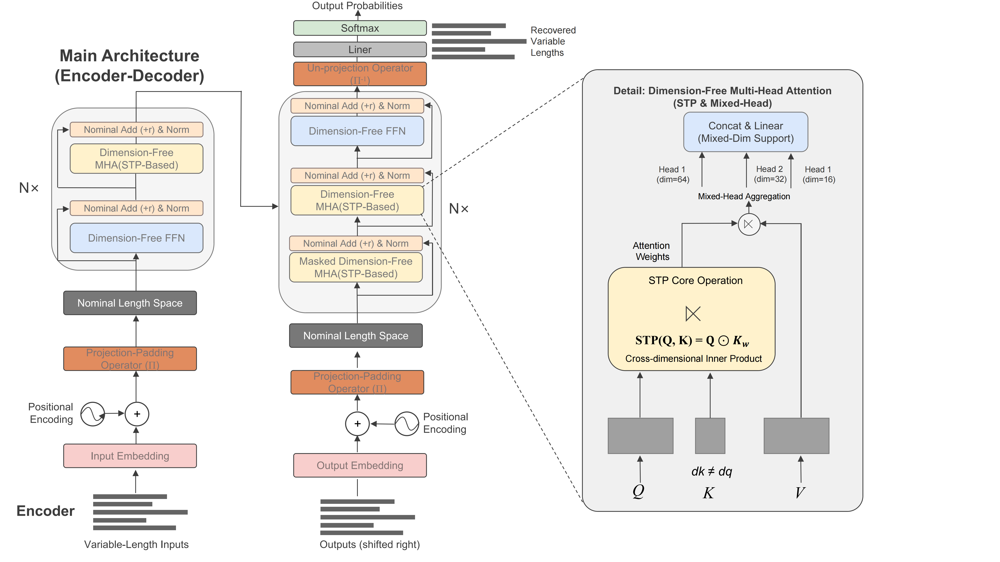

# STP-DFT: 基于投影填充的无维度 Transformer (Dimension-Free Transformer)



本项目是论文 **STP-DFT** 的官方 PyTorch 实现代码。

我们提出了一种通过 **投影填充 (Projection Padding)** 机制来高效处理变长序列（Heterogeneous Batches）的方法，旨在解决传统 Transformer 在处理不同长度数据时常用的 **零填充 (Zero-Padding)** 所导致的计算资源浪费问题。

## 核心贡献

- **无维度线性层 (Dimension-Free Linear)**：解耦了模型宽度与序列长度的绑定，支持动态输入。
- **投影填充 (Projection Padding)**：将变长序列动态投影到统一的名义维度（Nominal Dimension）进行计算，相比零填充显著提升了参数效率和训练速度。
- **可视化验证**：提供了详细的注意力可视化脚本，直观展示了投影填充如何避免注意力对“填充区域”的无效关注。

## 目录结构

本项目已针对开源进行了重新整理：

*   `src/`: 核心代码库 (包含模型定义 `dft_model.py`, 训练逻辑 `train.py`)
*   `experiments/`: 实验性代码 (包含不同维度的消融实验 `dim_vary/`)
*   `scripts/`: 论文绘图与分析脚本 (如 `visualize_attention.py`)
*   `assets/`: 论文插图与可视化结果
*   `notebooks/`: 探索性数据分析 (Scaling Laws 等)

## 安装依赖

```bash
pip install -r requirements.txt
```
核心依赖：`pytorch`, `transformers`, `datasets`, `wandb`, `matplotlib`。

## 快速开始

### 1. 数据准备
以莎士比亚字符级数据集为例：

```bash
python src/data/shakespeare_char/prepare.py
```

### 2. 及其模型训练
复现 STP-DFT (Projection Padding) 实验：

```bash
python src/train.py src/config/train_shakespeare_char.py
```

### 3. 可视化分析
生成论文级别的注意力对比图（对比零填充 vs 投影填充）：

```bash
python scripts/visualize_attention.py
```
*输出的 PDF 图表将保存在根目录下。*

## 实验结果

代码库中包含了我们在 OpenWebText 和 Shakespeare 数据集上的对比实验配置。详细的 Loss 曲线和注意力热力图请参考 `assets/` 目录或论文正文。

